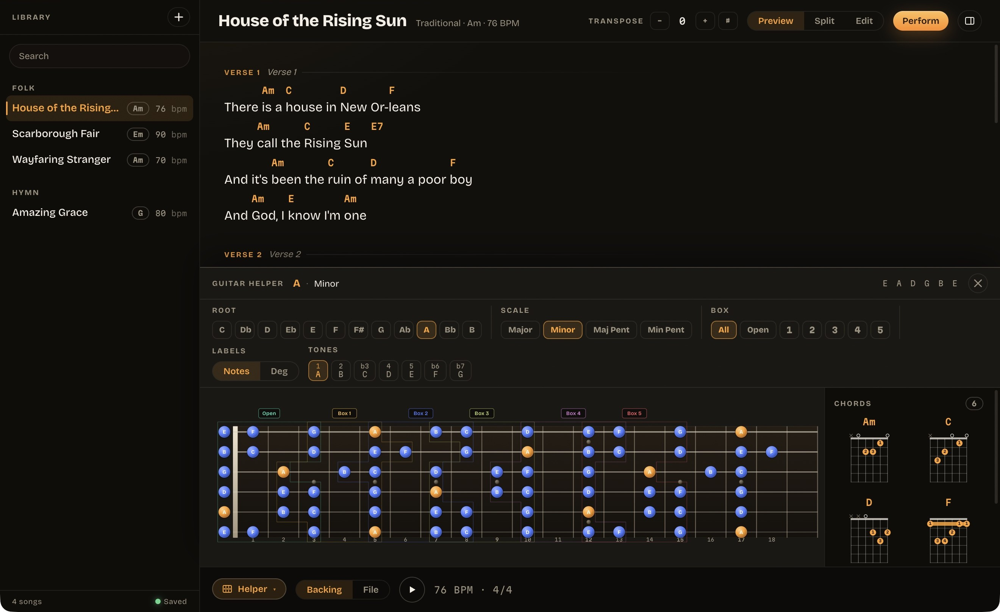
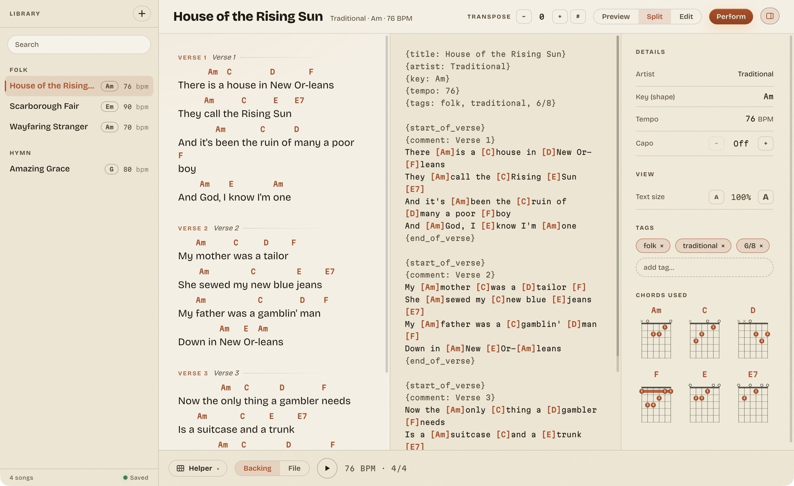

# ChordZ

A musician's notebook. Write a song with chords, find the shapes on your guitar, and take it on stage.

[](https://github.com/lexasoft123/ChordZ/actions/workflows/ci.yml)
[](https://github.com/lexasoft123/ChordZ/actions/workflows/build.yml)



An Electron desktop app built with React and TypeScript, wearing the same warm studio UI as [SingZ](https://github.com/lexasoft123/SingZ). Your song library stays on your computer. Fonts, UI and sample songs are bundled; writing and practicing need no account or cloud connection.

## What it does

- **Write with chords** — edit ChordPro text, read the rendered sheet, or keep both side by side.
- **Transpose** — move the chord sheet by semitones and choose flats or sharps. The key and diagrams follow; audio pitch stays unchanged.
- **Guitar helper** — explore major, minor and pentatonic scales on a fretboard, switch between notes and degrees, and see fingering diagrams for the chords in your song.
- **Practice** — play a local backing audio file or use the click track at the song's tempo.
- **Perform** — open a full-screen chord sheet with adjustable automatic scrolling and pause/resume controls.
- **Library** — search titles, artists and tags; organize songs by tag; create and delete songs with keyboard-accessible controls and visible save feedback.
- **Two palettes** — night studio and warm-paper Atelier. The first launch follows your system appearance; your choice is remembered.



## Download

Desktop installers will appear in [GitHub Releases](https://github.com/lexasoft123/ChordZ/releases): macOS Apple Silicon, macOS Intel and Windows x64. No release has been published yet.

The release pipeline is configured for **Developer ID signing and Apple notarization** on macOS. A tagged release requires the signing credentials and verifies its notarization tickets before uploading. Windows installers currently ship unsigned. See [macOS signing](docs/MACOS-SIGNING.md) for setup and verification.

## Develop

Use **Node.js 24** and npm.

```sh
npm ci
npm run dev
```

`dev` opens Electron. Open the Vite URL for the browser version. Desktop songs are stored in Electron's application data directory; browser songs use local storage. Changes save automatically, and an unreadable library disables saving to protect the existing file.

Keyboard: **⌘/Ctrl + Plus, Minus or 0** adjusts sheet text size; **⌘/Ctrl ⇧ G** toggles the guitar helper. In performance mode, **Space** pauses/resumes scrolling and **Esc** closes the sheet.

## Build and releases

```sh
npm test
npm run build
npm run dist -- --mac --arm64
npm run dist -- --mac --x64
npm run dist -- --win --x64
```

`build` generates `dist/` and `dist-electron/`; `dist` rebuilds and packages installers into `release/`. Local packaging never publishes anything.

[Checks](.github/workflows/ci.yml) runs tests and the production build on Linux, macOS and Windows. [Desktop release](.github/workflows/build.yml) builds macOS arm64/x64 DMGs and a Windows x64 NSIS installer on a matching `vVERSION` tag, then assembles a **draft** GitHub Release. Manual runs produce downloadable workflow artifacts.

Release infrastructure and family icons are adapted from SingZ, including its temporary-keychain signing setup and Hardened Runtime entitlements. Repository secrets must be configured separately for ChordZ.

Contributor docs: [Development and releases](docs/DEVELOPMENT.md) · [Apple signing and notarization](docs/MACOS-SIGNING.md).

## How it works

- **Main process** — local library persistence, native audio-file picker and window controls.
- **Preload bridge** — a small typed interface connecting React to Electron.
- **Renderer** — ChordPro parsing, chord transposition, guitar diagrams, Web Audio click track and the reading/editing workspace.
- **Shared UI** — `@singz/ui` 1.8.2 provides palettes, buttons, chips, dialogs and window controls. The archive is checked in so a fresh clone needs no sibling checkout; [vendor provenance](vendor/README.md) explains updates.
